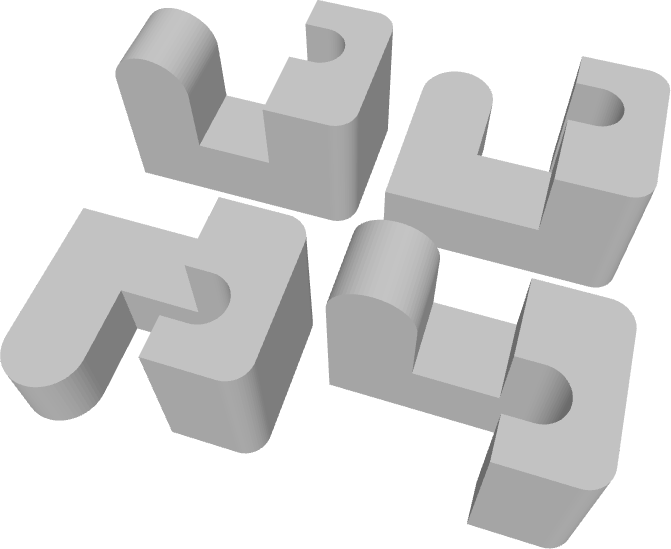

# Parametric SKÅDIS Cable Clips

Simple cable clips suitable for SKÅDIS pegboards, customizable to accommodate various cable diameters.

This was inspired by [UM3D's](https://www.printables.com/@UM_1026194) [ikea skadis cable clip](https://www.printables.com/model/1098062-ikea-skadis-cable-clip) models, but I wanted to be able to adjust cable diameter.

## License

The source code for this project is licensed under the MIT License.
